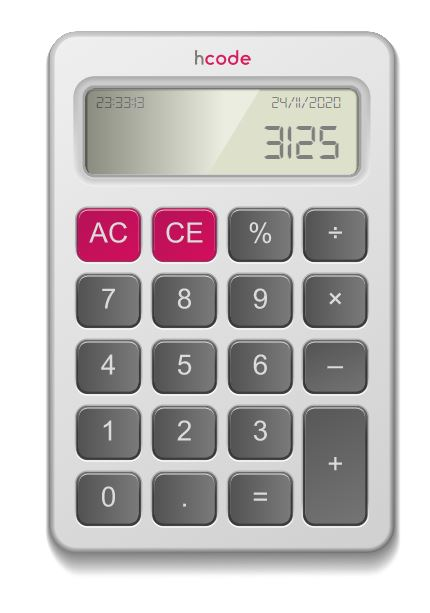
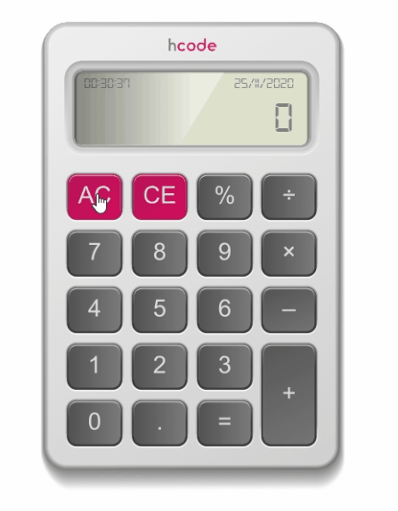
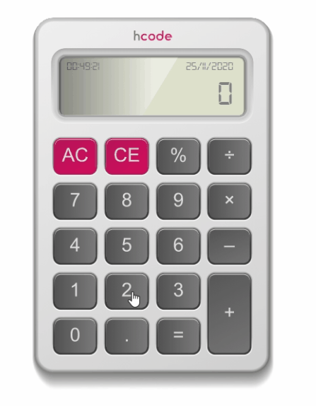
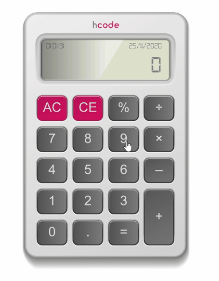
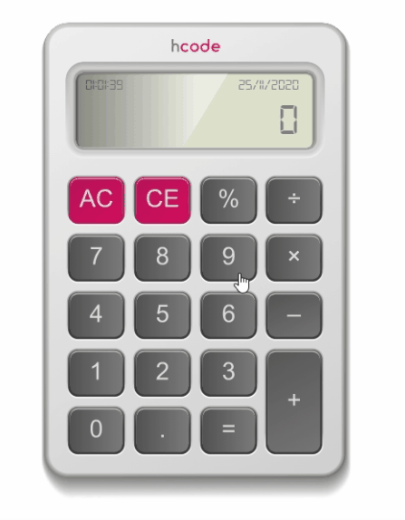
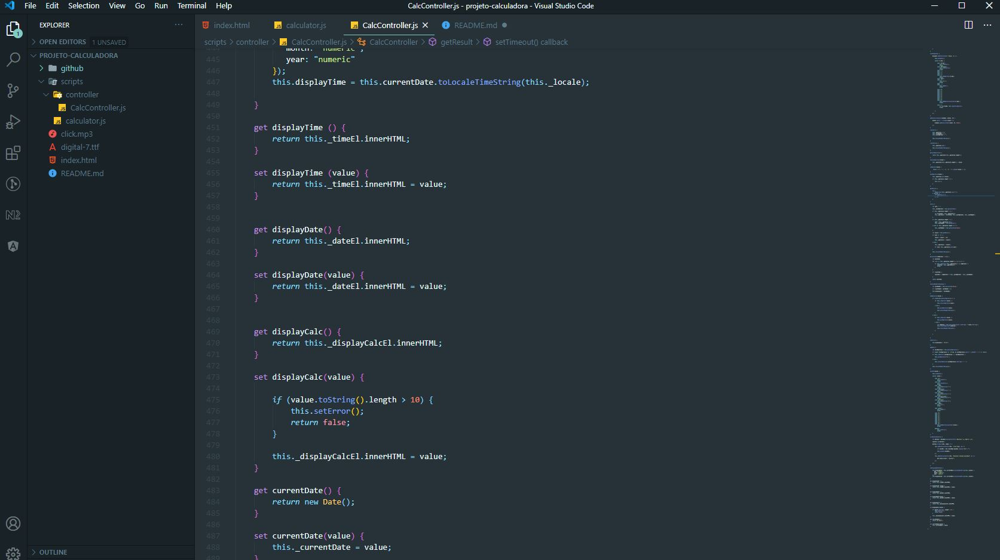

# Calculator - JavaScript
Projeto do curso HCODE com o intuito de colocar em prática vários conceitos importantes sobre o JavaScript. Esta calculadora é feita em SVG e programada do zero, transformando um layout em código funcional. 

<h1 align="center">
    
</h1>

## Com o que trabalhamos? 
✅ Operações Primárias

✅ Eventos (inclusive no teclado e no mouse)

✅ ForEach

✅ Orientação a Objetos

✅ If - Else

✅ Classes, Métodos e Atributos 

## :camera: Veja:

### Operações

### Exibição

### Código:

## :rocket: Tecnologia

<table>
  <thead>
    <th>Back-end</th>
    <th>Front-end</th>
  </thead>
  <tbody>
    <tr>
      <td>JavaScript</td>
      <td>Layout SVG</td>
    </tr>
  </tbody>
</table>

